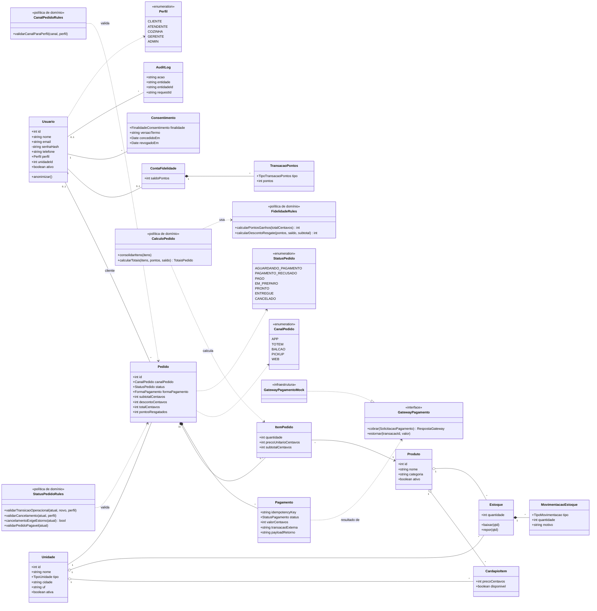

# Diagrama de Classes (visão de domínio)

Entidades do domínio, as regras de negócio e a interface do gateway de pagamento.

```mermaid
classDiagram
    direction LR

    class Usuario {
        +int id
        +string nome
        +string email
        -string senhaHash
        +string telefone
        +Perfil perfil
        +int unidadeId
        +boolean ativo
        +anonimizar()
    }
    class Unidade {
        +int id
        +string nome
        +TipoUnidade tipo
        +string cidade
        +string uf
        +boolean ativa
    }
    class Produto {
        +int id
        +string nome
        +string categoria
        +boolean ativo
    }
    class CardapioItem {
        +int precoCentavos
        +boolean disponivel
    }
    class Estoque {
        +int quantidade
        +baixar(qtd)
        +repor(qtd)
    }
    class MovimentacaoEstoque {
        +TipoMovimentacao tipo
        +int quantidade
        +string motivo
    }
    class Pedido {
        +int id
        +CanalPedido canalPedido
        +StatusPedido status
        +FormaPagamento formaPagamento
        +int subtotalCentavos
        +int descontoCentavos
        +int totalCentavos
        +int pontosResgatados
    }
    class ItemPedido {
        +int quantidade
        +int precoUnitarioCentavos
        +int subtotalCentavos
    }
    class Pagamento {
        +string idempotencyKey
        +StatusPagamento status
        +int valorCentavos
        +string transacaoExterna
        +string payloadRetorno
    }
    class ContaFidelidade {
        +int saldoPontos
    }
    class TransacaoPontos {
        +TipoTransacaoPontos tipo
        +int pontos
    }
    class Consentimento {
        +FinalidadeConsentimento finalidade
        +string versaoTermo
        +Date concedidoEm
        +Date revogadoEm
    }
    class AuditLog {
        +string acao
        +string entidade
        +string entidadeId
        +string requestId
    }

    class StatusPedidoRules {
        <<política de domínio>>
        +validarTransicaoOperacional(atual, novo, perfil)
        +validarCancelamento(atual, perfil)
        +cancelamentoExigeEstorno(atual) bool
        +validarPedidoPagavel(atual)
    }
    class CanalPedidoRules {
        <<política de domínio>>
        +validarCanalParaPerfil(canal, perfil)
    }
    class CalculoPedido {
        <<política de domínio>>
        +consolidarItens(itens)
        +calcularTotais(itens, pontos, saldo) TotaisPedido
    }
    class FidelidadeRules {
        <<política de domínio>>
        +calcularPontosGanhos(totalCentavos) int
        +calcularDescontoResgate(pontos, saldo, subtotal) int
    }
    class GatewayPagamento {
        <<interface>>
        +cobrar(SolicitacaoPagamento) RespostaGateway
        +estornar(transacaoId, valor)
    }
    class GatewayPagamentoMock {
        <<infraestrutura>>
    }

    class CanalPedido {
        <<enumeration>>
        APP
        TOTEM
        BALCAO
        PICKUP
        WEB
    }
    class StatusPedido {
        <<enumeration>>
        AGUARDANDO_PAGAMENTO
        PAGAMENTO_RECUSADO
        PAGO
        EM_PREPARO
        PRONTO
        ENTREGUE
        CANCELADO
    }
    class Perfil {
        <<enumeration>>
        CLIENTE
        ATENDENTE
        COZINHA
        GERENTE
        ADMIN
    }

    Unidade "1" o-- "*" CardapioItem
    Produto "1" o-- "*" CardapioItem
    Unidade "1" o-- "*" Estoque
    Produto "1" o-- "*" Estoque
    Estoque "1" *-- "*" MovimentacaoEstoque
    Unidade "1" -- "*" Pedido
    Usuario "0..1" -- "*" Pedido : cliente
    Pedido "1" *-- "1..*" ItemPedido
    ItemPedido "*" --> "1" Produto
    Pedido "1" *-- "*" Pagamento
    Usuario "1" -- "0..1" ContaFidelidade
    ContaFidelidade "1" *-- "*" TransacaoPontos
    Usuario "1" -- "*" Consentimento
    Usuario "0..1" -- "*" AuditLog

    Pedido ..> CanalPedido
    Pedido ..> StatusPedido
    Usuario ..> Perfil
    StatusPedidoRules ..> Pedido : valida
    CanalPedidoRules ..> Pedido : valida
    CalculoPedido ..> ItemPedido : calcula
    CalculoPedido ..> FidelidadeRules : usa
    GatewayPagamentoMock ..|> GatewayPagamento
    Pagamento ..> GatewayPagamento : resultado de
```
