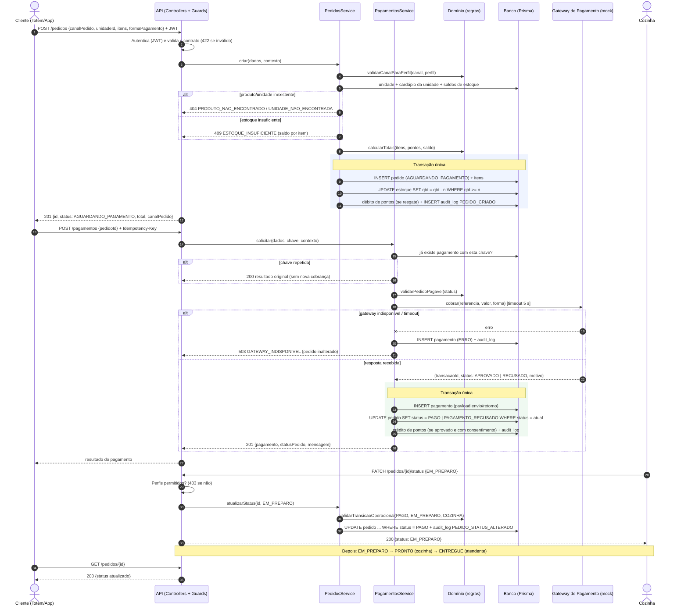
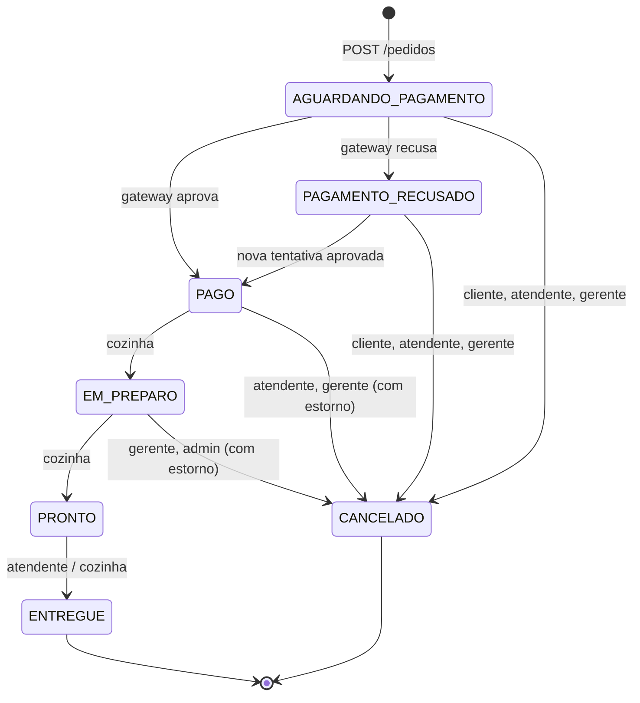

# Diagrama de sequência: pedido, pagamento e status

```mermaid
sequenceDiagram
    autonumber
    actor C as Cliente (Totem/App)
    participant API as API (Controllers + Guards)
    participant PS as PedidosService
    participant PG as PagamentosService
    participant D as Domínio (regras)
    participant DB as Banco (Prisma)
    participant GW as Gateway de Pagamento (mock)
    actor K as Cozinha

    C->>API: POST /pedidos {canalPedido, unidadeId, itens, formaPagamento} + JWT
    API->>API: Autentica (JWT) e valida o contrato (422 se inválido)
    API->>PS: criar(dados, contexto)
    PS->>D: validarCanalParaPerfil(canal, perfil)
    PS->>DB: unidade + cardápio da unidade + saldos de estoque
    alt produto/unidade inexistente
        PS-->>API: 404 PRODUTO_NAO_ENCONTRADO / UNIDADE_NAO_ENCONTRADA
    else estoque insuficiente
        PS-->>API: 409 ESTOQUE_INSUFICIENTE (saldo por item)
    end
    PS->>D: calcularTotais(itens, pontos, saldo)
    rect rgba(120,160,255,0.12)
        note over PS,DB: Transação única
        PS->>DB: INSERT pedido (AGUARDANDO_PAGAMENTO) + itens
        PS->>DB: UPDATE estoque SET qtd = qtd - n WHERE qtd >= n
        PS->>DB: débito de pontos (se resgate) + INSERT audit_log PEDIDO_CRIADO
    end
    API-->>C: 201 {id, status: AGUARDANDO_PAGAMENTO, total, canalPedido}

    C->>API: POST /pagamentos {pedidoId} + Idempotency-Key
    API->>PG: solicitar(dados, chave, contexto)
    PG->>DB: já existe pagamento com esta chave?
    alt chave repetida
        PG-->>API: 200 resultado original (sem nova cobrança)
    end
    PG->>D: validarPedidoPagavel(status)
    PG->>GW: cobrar(referencia, valor, forma) [timeout 5 s]
    alt gateway indisponível / timeout
        GW--xPG: erro
        PG->>DB: INSERT pagamento (ERRO) + audit_log
        PG-->>API: 503 GATEWAY_INDISPONIVEL (pedido inalterado)
    else resposta recebida
        GW-->>PG: {transacaoId, status: APROVADO | RECUSADO, motivo}
        rect rgba(120,200,140,0.12)
            note over PG,DB: Transação única
            PG->>DB: INSERT pagamento (payload envio/retorno)
            PG->>DB: UPDATE pedido SET status = PAGO | PAGAMENTO_RECUSADO WHERE status = atual
            PG->>DB: crédito de pontos (se aprovado e com consentimento) + audit_log
        end
        PG-->>API: 201 {pagamento, statusPedido, mensagem}
    end
    API-->>C: resultado do pagamento

    K->>API: PATCH /pedidos/{id}/status {EM_PREPARO}
    API->>API: Perfis permitidos? (403 se não)
    API->>PS: atualizarStatus(id, EM_PREPARO)
    PS->>D: validarTransicaoOperacional(PAGO, EM_PREPARO, COZINHA)
    PS->>DB: UPDATE pedido ... WHERE status = PAGO + audit_log PEDIDO_STATUS_ALTERADO
    API-->>K: 200 {status: EM_PREPARO}
    note over K,API: Depois: EM_PREPARO → PRONTO (cozinha) → ENTREGUE (atendente)
    C->>API: GET /pedidos/{id}
    API-->>C: 200 {status atualizado}
```

## Máquina de estados do pedido

```mermaid
stateDiagram-v2
    [*] --> AGUARDANDO_PAGAMENTO: POST /pedidos
    AGUARDANDO_PAGAMENTO --> PAGO: gateway aprova
    AGUARDANDO_PAGAMENTO --> PAGAMENTO_RECUSADO: gateway recusa
    PAGAMENTO_RECUSADO --> PAGO: nova tentativa aprovada
    PAGO --> EM_PREPARO: cozinha
    EM_PREPARO --> PRONTO: cozinha
    PRONTO --> ENTREGUE: atendente / cozinha
    AGUARDANDO_PAGAMENTO --> CANCELADO: cliente, atendente, gerente
    PAGAMENTO_RECUSADO --> CANCELADO: cliente, atendente, gerente
    PAGO --> CANCELADO: atendente, gerente (com estorno)
    EM_PREPARO --> CANCELADO: gerente, admin (com estorno)
    ENTREGUE --> [*]
    CANCELADO --> [*]
```
